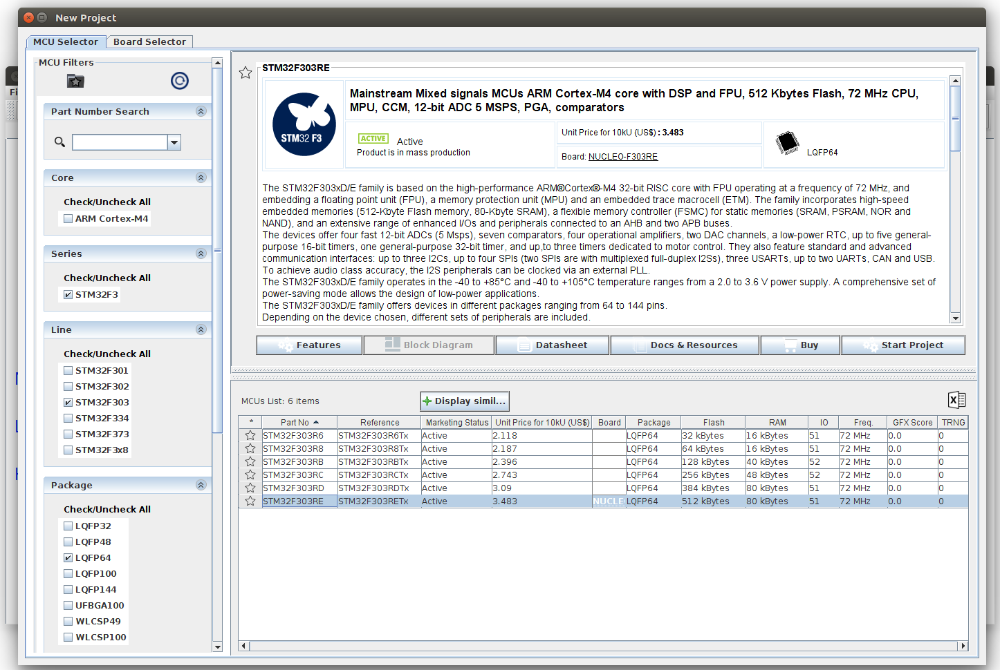

## STMCubeMX 101: Blink

1. Download and start STMCubeMX.

2. Start a new project. This tutorial uses the STM32F303RE Nucleo development board. Select STM32F303 from the Line category. Select LQFP64 from the Package category. Select STM32F303RE from the MCU List. Finally click on Start Project.

3. The indicator LED is on portA pin5. Click on PA5 in the Pinout MCU viewer, set to GPIO_Output. 

4. Open Project Settings. Name your project e.g Blink, Select Makefile for Toolchain / IDE.
On the Code Generator page, choosen settings suggested by @dBC.

Finaly click Project > Generate Code. This generates the source tree for your project, including most of the HAL calls needed. The code is full of sections such as:

    /* USER CODE BEGIN 2 */
    
    /* USER CODE END 2 */
    
which is where you put your own code.

**Fixing the Makefile**

Open the project directory and then open the Makefile in an editor.

Change 

    BINPATH = 

to: 

    BINPATH = /usr/bin
    
For some reason the section that starts: 

    ######################################
    # source
    ######################################
    # C sources
    C_SOURCES =  \

is full of duplicate entries which causes the compiler to fail, remove the duplicate entries until the compilation is successful.

**Compile and Upload**

To compile, just type make in terminal:

    make
    
To re-compile:

    make clean
    make

Upload:

    cp build/Blink.bin /media/username/NODE_F303RE/

**Adding in the blink code**

Open Src/main.c in an editor, add the following two lines into the while loop in the user section:

    /* Infinite loop */
    /* USER CODE BEGIN WHILE */
    while (1)
    {
      HAL_GPIO_TogglePin(GPIOA, GPIO_PIN_5);
      HAL_Delay(200);
    /* USER CODE END WHILE */

    /* USER CODE BEGIN 3 */

    }
    /* USER CODE END 3 */

Recompile
    
    make
    
Upload:

    cp build/Blink.bin /media/username/NODE_F303RE/
    
## Serial Output

To enable USART output enable the RX and TX pins for USART2 (PA2 & PA3) using the pinout viewer:

Click on Configuration, USART2 and then Parameter Settings and enter your desired baud rate, worth length:

Click on 'Generate Code' again and open main.c in an editor again. Add a char array to hold output contents at the top of the file in the private variables section:

In main.c:

    /* USER CODE BEGIN PV */
    /* Private variables ---------------------------------------------------------*/
    char log_buffer[100];

and then the following lines in the loop to print 'Hello World':

    /* Infinite loop */
    /* USER CODE BEGIN WHILE */
    while (1)
    {
      HAL_GPIO_TogglePin(GPIOA, GPIO_PIN_5);
      
      sprintf(log_buffer,"Hello World\r\n");
      debug_printf(log_buffer);
      
      HAL_Delay(200);
    /* USER CODE END WHILE */

    /* USER CODE BEGIN 3 */

    }
    /* USER CODE END 3 */
    
At the bottom of usart.c, add the following function to print the string:

    /* USER CODE BEGIN 1 */
    void debug_printf (char* p) {
      HAL_UART_Transmit(&huart2, (uint8_t*)p, strlen(p), 1000);
    }
    /* USER CODE END 1 */

Compile and upload again.
    
Serial monitor with minicom:

    minicom -b115200 -D/dev/ttyACM0

