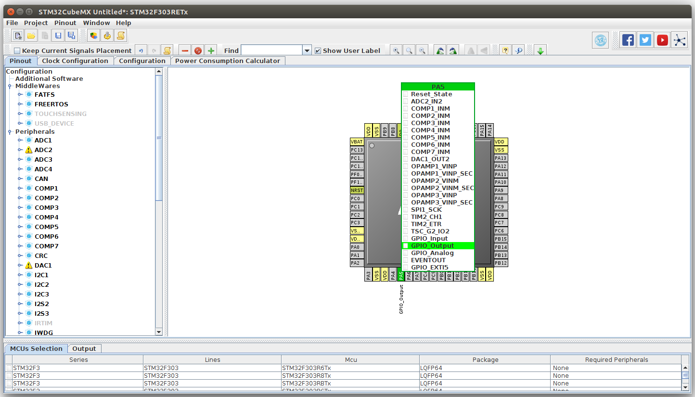
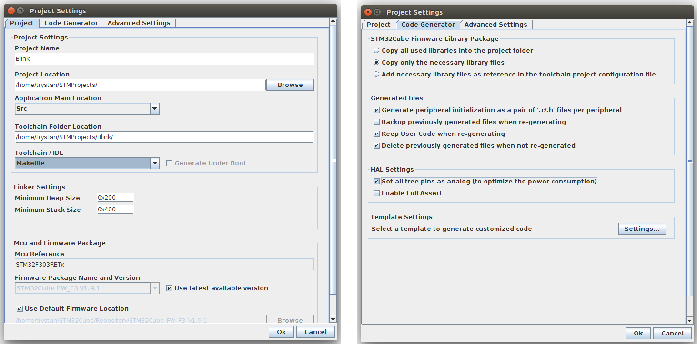
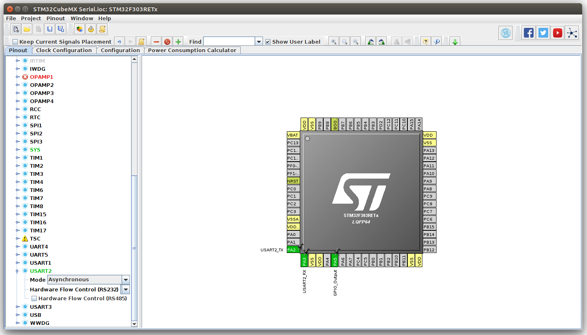
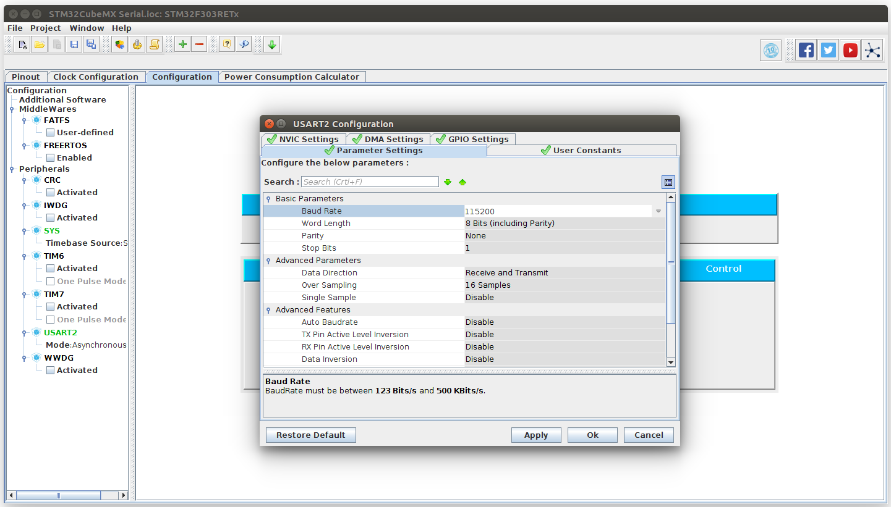
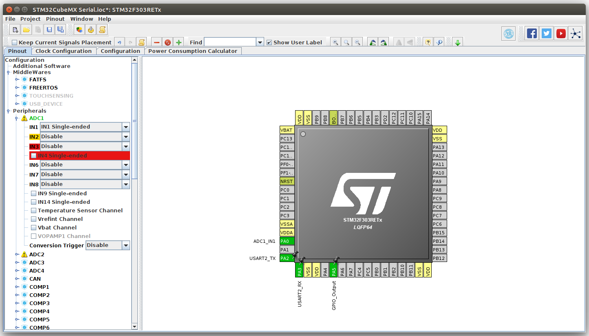

## STMCubeMX 101: Blink

1. Download and start STMCubeMX.

2. Start a new project. This tutorial uses the STM32F303RE Nucleo development board. Select STM32F303 from the Line category. Select LQFP64 from the Package category. Select STM32F303RE from the MCU List. Finally click on Start Project.

3. The indicator LED is on portA pin5. Click on PA5 in the Pinout MCU viewer, set to GPIO_Output. 

4. Open Project Settings. Name your project e.g Blink, Select Makefile for Toolchain / IDE.
On the Code Generator page, choosen settings suggested by @dBC.

Finaly click Project > Generate Code. This generates the source tree for your project, including most of the HAL calls needed. The code is full of sections such as:

    /* USER CODE BEGIN 2 */
    
    /* USER CODE END 2 */
    
which is where you put your own code.

**Fixing the Makefile**

Open the project directory and then open the Makefile in an editor.

Change 

    BINPATH = 

to: 

    BINPATH = /usr/bin
    
For some reason the section that starts: 

    ######################################
    # source
    ######################################
    # C sources
    C_SOURCES =  \

is full of duplicate entries which causes the compiler to fail, remove the duplicate entries until the compilation is successful.

**Compile and Upload**

To compile, just type make in terminal:

    make
    
To re-compile:

    make clean
    make

Upload:

    cp build/Blink.bin /media/username/NODE_F303RE/

**Adding in the blink code**

Open Src/main.c in an editor, add the following two lines into the while loop in the user section:

    /* Infinite loop */
    /* USER CODE BEGIN WHILE */
    while (1)
    {
      HAL_GPIO_TogglePin(GPIOA, GPIO_PIN_5);
      HAL_Delay(200);
    /* USER CODE END WHILE */

    /* USER CODE BEGIN 3 */

    }
    /* USER CODE END 3 */

Recompile
    
    make
    
Upload:

    cp build/Blink.bin /media/username/NODE_F303RE/
    
## Serial Output

To enable USART output enable the RX and TX pins for USART2 (PA2 & PA3) using the pinout viewer:

Click on Configuration, USART2 and then Parameter Settings and enter your desired baud rate, worth length:

Click on 'Generate Code' again and open main.c in an editor again. Add a char array to hold output contents at the top of the file in the private variables section:

In main.c:

    /* USER CODE BEGIN PV */
    /* Private variables ---------------------------------------------------------*/
    char log_buffer[100];

and then the following lines in the loop to print 'Hello World':

    /* Infinite loop */
    /* USER CODE BEGIN WHILE */
    while (1)
    {
      HAL_GPIO_TogglePin(GPIOA, GPIO_PIN_5);
      
      sprintf(log_buffer,"Hello World\r\n");
      debug_printf(log_buffer);
      
      HAL_Delay(200);
    /* USER CODE END WHILE */

    /* USER CODE BEGIN 3 */

    }
    /* USER CODE END 3 */
    
At the bottom of usart.c, add the following function to print the string:

    /* USER CODE BEGIN 1 */
    void debug_printf (char* p) {
      HAL_UART_Transmit(&huart2, (uint8_t*)p, strlen(p), 1000);
    }
    /* USER CODE END 1 */

Compile and upload again.
    
Serial monitor with minicom:

    minicom -b115200 -D/dev/ttyACM0

## Analog Read

**Basic example of reading from a single analog input**

Start by setting PA0 to a single-ended ADC1 analog input.

Navigate to the configuration tab for ADC1 and configure as follows:

Project > Generate Code

Towards the bottom of the file adc.c, in the 'user code begin 1' section add the following function:

    uint32_t analogRead()
    {
      uint32_t ADCValue = 0;
      HAL_ADC_Start(&hadc1);
      if (HAL_ADC_PollForConversion(&hadc1, 1000000) == HAL_OK) {
          ADCValue = HAL_ADC_GetValue(&hadc1);
      }
      HAL_ADC_Stop(&hadc1);
      
      return ADCValue;
    }
    
Call the function and print the result in main.c:

    /* Infinite loop */
    /* USER CODE BEGIN WHILE */
    while (1)
    {
      sprintf(log_buffer, "ADCValue: %d\r\n", analogRead());
      debug_printf(log_buffer);
      HAL_Delay(200);
          
      HAL_GPIO_TogglePin(GPIOA, GPIO_PIN_5);
      HAL_Delay(100);
    /* USER CODE END WHILE */
    
Compile and Upload, see the result with minicom:

    minicom -b115200 -D/dev/ttyACM0
    
Example result:
                                                               
    ADCValue: 0
    ADCValue: 0
    ADCValue: 0
    ADCValue: 0
    ADCValue: 0
    ADCValue: 0
    ADCValue: 4038
    ADCValue: 4038
    ADCValue: 4037
    ADCValue: 4038
    ADCValue: 4037
    
**Reading from two analog inputs**

Using STM32CubeMX, configure PA1 as a single ended analog input as well and click on 'Generate Code' again.

Modify the analagRead function to include the following channel configuration section:

    uint32_t analogRead(uint32_t channel)
    {

      ADC_ChannelConfTypeDef sConfig;
      sConfig.Channel = channel;
      sConfig.Rank = ADC_REGULAR_RANK_1;
      sConfig.SingleDiff = ADC_SINGLE_ENDED;
      sConfig.SamplingTime = ADC_SAMPLETIME_601CYCLES_5;
      sConfig.OffsetNumber = ADC_OFFSET_NONE;
      sConfig.Offset = 0;

      if (HAL_ADC_ConfigChannel(&hadc1, &sConfig) != HAL_OK) {
        _Error_Handler(__FILE__, __LINE__);
      }

      uint32_t ADCValue = 0;
      HAL_ADC_Start(&hadc1);
      if (HAL_ADC_PollForConversion(&hadc1, 1000000) == HAL_OK) {
          ADCValue = HAL_ADC_GetValue(&hadc1);
      }
      HAL_ADC_Stop(&hadc1);
      
      return ADCValue;
    }
    
This configuration code is copied straight from the bottom of the MX_ADC1_Init function.
    
Call the modified function from main.c:

    /* Infinite loop */
    /* USER CODE BEGIN WHILE */
    while (1)
    {
      sprintf(log_buffer, "ADCValue 1: %d\r\n", analogRead(1));
      debug_printf(log_buffer);
      HAL_Delay(200);
      
      sprintf(log_buffer, "ADCValue 2: %d\r\n", analogRead(2));
      debug_printf(log_buffer);
      HAL_Delay(200);
          
      HAL_GPIO_TogglePin(GPIOA, GPIO_PIN_5);
      HAL_Delay(100);
    /* USER CODE END WHILE */
    
Example output with PA0 connected to ground and PA1 connected to 3.3V:

    ADCValue 1: 0
    ADCValue 2: 4037
    ADCValue 1: 0
    ADCValue 2: 4038
    ADCValue 1: 0
    ADCValue 2: 4037
    ADCValue 1: 0
    ADCValue 2: 4038
    ADCValue 1: 0
    ADCValue 2: 4038
    ADCValue 1: 0
    ADCValue 2: 4037
    ADCValue 1: 0
    ADCValue 2: 4037
    
**Reading from two analog inputs sequentially with scan mode**

The last example configure's, starts, reads and then stops the ADC for each channel. With scan conversion mode its possible to automatically read through a configured list of channels sequentially.

Enable 'Scan Conversion Mode' in the ADC configuration window. 

Keep End of Conversion Selection on 'End of single conversion'.

Remove the analogRead function from adc.c that we added in the previous examples. Replace the code in the main.c loop with:

    /* Infinite loop */
    /* USER CODE BEGIN WHILE */
    while (1)
    {

      HAL_ADC_Start(&hadc1);
      
      if (HAL_ADC_PollForConversion(&hadc1, 1000) == HAL_OK) {
          ADCValue = HAL_ADC_GetValue(&hadc1);
          sprintf(log_buffer, "ADCValue 1: %d\r\n", ADCValue);
          debug_printf(log_buffer);
          
          ADCValue = HAL_ADC_GetValue(&hadc1);
          sprintf(log_buffer, "ADCValue 2: %d\r\n", ADCValue);
          debug_printf(log_buffer);
      }
      
      HAL_ADC_Stop(&hadc1);
      HAL_Delay(200);
          
      HAL_GPIO_TogglePin(GPIOA, GPIO_PIN_5);
      HAL_Delay(100);
    /* USER CODE END WHILE */
    
**Analog read on completion interrupt**

This example replaces the polling for completed ADC conversions with an callback function called via an interrupt.

- Enable 'Scan Conversion Mode' in the ADC configuration window. 
- Keep End of Conversion Selection on 'End of single conversion'.
- NVIC Settings: Enable ADC1 and ADC2 interrupts.

In adc.c:

    /* USER CODE BEGIN 0 */
    char log_buffer[100];

    /* USER CODE END 0 */
    
    ---

    /* USER CODE BEGIN 1 */
    void HAL_ADC_ConvCpltCallback(ADC_HandleTypeDef* hadc1)
    {
      uint32_t ADCValue = HAL_ADC_GetValue(hadc1);
      sprintf(log_buffer, "ADCValue 1: %d\r\n", ADCValue);
      debug_printf(log_buffer);

      ADCValue = HAL_ADC_GetValue(hadc1);
      sprintf(log_buffer, "ADCValue 2: %d\r\n", ADCValue);
      debug_printf(log_buffer);
    }
    /* USER CODE END 1 */
    
In main.c:

    /* Infinite loop */
    /* USER CODE BEGIN WHILE */
    while (1)
    {     
      HAL_ADC_Start_IT(&hadc1);
      HAL_GPIO_TogglePin(GPIOA, GPIO_PIN_5);
      HAL_Delay(500);
    /* USER CODE END WHILE */
    
## DMA

Starting from where we left off in the previous example with ADC1 channel 1 and 2 enabled and configured.

- Enable Continuous Conversions
- Enable DMA Continuous Requests
- End of Conversion to be End of Sequence
- Add DMA channel in the DMA Settings tab
- Select Circular mode
- NVIC Settings: enable 'DMA1 channel1 global interrupt'
- NVIC Settings: disable 'ADC1 and ADC2 interrupts'
- NVIC Code generation, tick in generate IRQ handler for Time base and DMA1.

Project > Generate Code

**User source code edits**

In adc.c the main addition is the callback function to mark half way through block of conversions (0-2000) and callback to mark complete conversion (2000-4000). There are also variables defined at the top and in adc.h.

adc.c:

    /* USER CODE BEGIN 1 */
    void HAL_ADC_ConvHalfCpltCallback(ADC_HandleTypeDef* hadc)
    {
      if (adc1_half_conv_complete) {
        adc1_half_conv_overrun = true;
        adc1_half_conv_complete = false;
      } else
        adc1_half_conv_complete = true;
    }

    void HAL_ADC_ConvCpltCallback(ADC_HandleTypeDef* hadc)
    {
      if (adc1_full_conv_complete) {
        adc1_full_conv_overrun = true;
        adc1_full_conv_complete = false;
      } else
        adc1_full_conv_complete = true;
    }

    void start_ADC1 (void) {
      HAL_ADC_Start_DMA(&hadc1, (uint32_t*)adc1_dma_buff, ADC1_DMA_BUFFSIZE);
    }
    /* USER CODE END 1 */

In main.c there are two additions:

1. A function for processing a frame/block of samples:

    /* USER CODE BEGIN 0 */
    void process_frame(int offset)
    {
      for(int i=0; i<2000; i+=2) 
      {
        sampleA0 = adc1_dma_buff[offset+i];
        sumA0 += sampleA0;
        sampleA1 = adc1_dma_buff[offset+i+1];
        sumA1 += sampleA1;
      }
    }
    /* USER CODE END 0 */
    
2. The main loop:

    /* Infinite loop */
    /* USER CODE BEGIN WHILE */
    while (1)
    {
      if (adc1_half_conv_complete && !adc1_half_conv_overrun) 
      {
        HAL_GPIO_WritePin(GPIOA, GPIO_PIN_5, GPIO_PIN_RESET);      // LED off
        adc1_half_conv_complete = false;
        process_frame(0);  // 0 to 2000
      }

      if (adc1_full_conv_complete && !adc1_full_conv_overrun) 
      {
        HAL_GPIO_WritePin(GPIOA, GPIO_PIN_5, GPIO_PIN_SET);        // LED on
        adc1_full_conv_complete = false;
        process_frame(2000); // 2000 to 4000
        
        // 4000 Samples all together divided by 2 inputs = 2000 samples per input
        int meanA0 = sumA0 / 2000;
        int meanA1 = sumA1 / 2000;
        
        sprintf(log_buffer,"Mean A0 %d\r\n", meanA0);
        debug_printf(log_buffer);

        sprintf(log_buffer,"Mean A1 %d\r\n", meanA1);
        debug_printf(log_buffer);
        
        sumA0 = 0;
        sumA1 = 0;
      }
    /* USER CODE END WHILE */

Makefile flags -c99, change line:

    CFLAGS += -MMD -MP -MF"$(@:%.o=%.d)" -MT"$(@:%.o=%.d)"

to

    CFLAGS += -MMD -MP -MF"$(@:%.o=%.d)" -MT"$(@:%.o=%.d)" -std=c99
    

