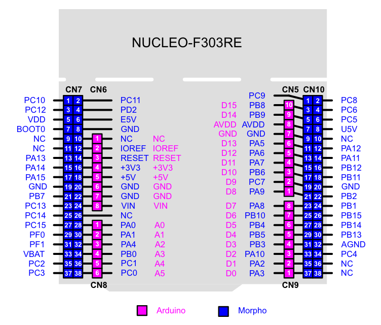
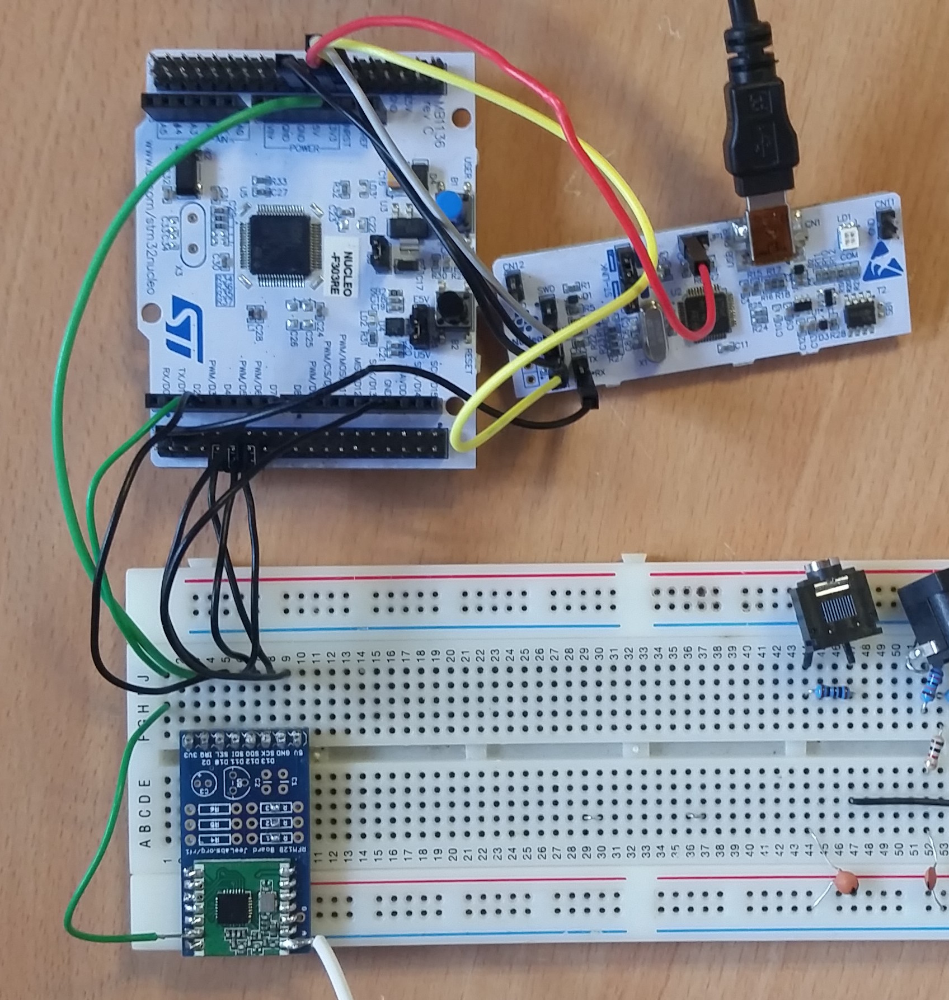
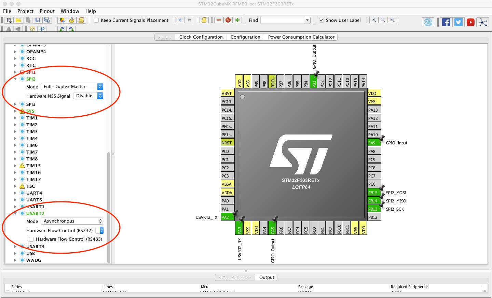
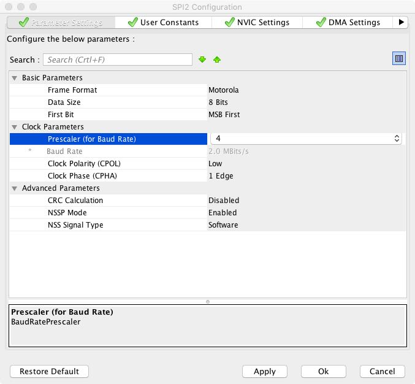
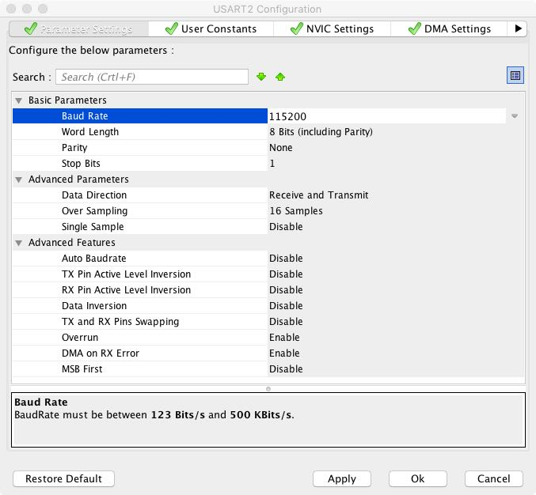
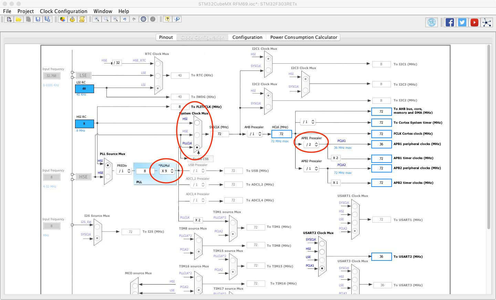
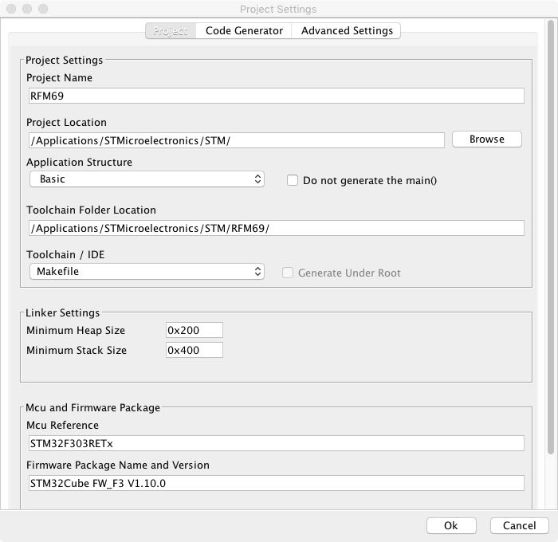
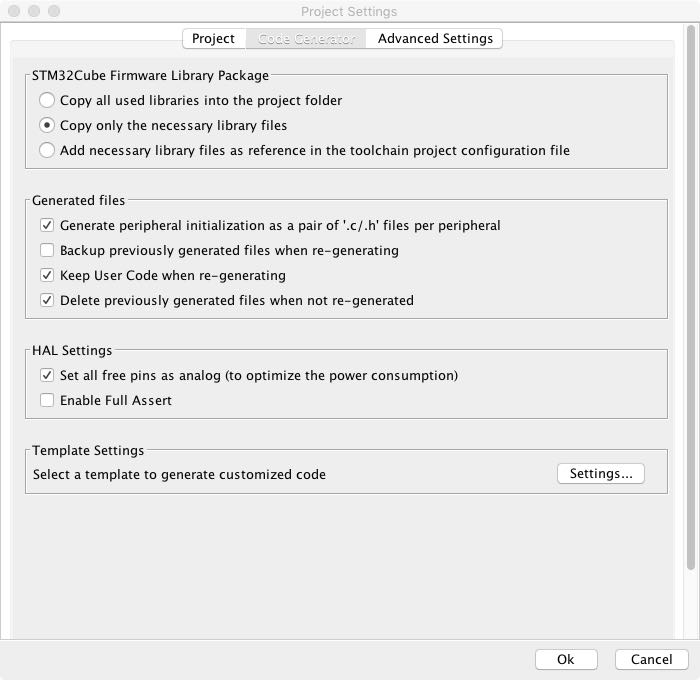

## RFM69

Author: @danbates2

Credit to @dBC and @cristi85 for their help getting this to work.

---

How to connect a RFM69 transceiver module to a STM32. This guide uses:

- STM32F303RE Nucleo Board.  
- STM32CubeMX v4.25.0
- LowPowerLab RFM69 library based Tx/Rx code.
- The RFM69.c has some untested code, an attempt at creating compatibility to receive JeeLib packets.

    _Nucleo - RFM69_  
    PA9 - DIO0  
    PB3 - SEL  
    PB13 - CLK  
    PB14 - MISO  
    PB15 - MOSI  
    optional:  
    PA10 - RST  

  

### CubeMX Settings  

1. Create new Cube project with the chosen board, here it's the Nucleo STM32F303RE, and Save the project somewhere.  
2. Set the UART, SPI and GPIO pins as shown below. USART and SPI pins will be highlighted orange at first, this indicates not being initialized, a mode requires selecting. See the Configuration to the left and scroll down to SPI2 and USART2. Set the SPI as 'Full Duplex Master' and USART as 'Asynchronous'.  
The pins I've chosen here relate to a convenient use of the Nucleo, other pins able to perform the same functions can be used.

  

3. Go to the Configuration tab and open the SPI window. Set data size to 8 bits and Clock prescaler to 4.  

  

4. Click OK. Now open the USART window, change the baud rate to 115200.

  

5. The clock requires setup, the image below shows three changes.  

  

6. At the top menu bar, Project > Settings, opens the window where the project name and several options are set as shown below:  

  

  

Click OK to save settings.  

7. Find and Click "Generate Code".

### Makefile

8. Open the project folder and see the files generated by CubeMX, we need to modify the Makefile, open it.  
The following is a personal flavour.. The necessary build options are kept in an separate file called RFM69.mak, kept in the same folder as the Makefile. I then add the following line to the end of the Makefile:  

        -include $(TARGET).mak

    RFM69.mak contains:  

        BINPATH = /usr/local/gcc-arm-none-eabi-8-2018-q4-major/bin
        CFLAGS += -std=gnu99
        LDFLAGS += -Xlinker --no-wchar-size-warning

These and other settings can then easily be copied to future projects. On Ubuntu gcc-arm-none-eabi can be found with the following BINPATH:

        BINPATH = /usr/bin

9. Test the settings by opening Terminal at the project folder and:

        make

the compiler should work its magic, filling a new directory 'build'. The .bin file generated can then be used to flash the STM32.

### Code additions  

#### RFM69 Library

This example uses an adaptation of the RFM69 LowPowerLabs library by @cristi85, including further modifications. It is not yet compatible with JeeLabs radio packets.

- Original C++ RFM69 library by LowPowerLab: <https://github.com/LowPowerLab/RFM69>  
- Port into pure C by @cristi85 <https://github.com/cristi85/RFM69> and thanks to him for help via email.  
- The modified fork, relevant to this project can be found here:  <https://github.com/danbates2/RFM69>  

Download the forked repository and copy the .c and .h files to 'Src' and 'Inc' respectively.  

Reopen the Makefile, add the lines

    Src/RFM69.c \
    Src/RFM69_ext.c \

as shown below in the 'C sources' section:

  

Check this list of C sources for duplicates and delete them, this is a bug in v4.25.0 of CubeMX.

---

###### Add the following code to spi.c :  

    /* USER CODE BEGIN 1 */

    uint8_t SPI_transfer8 (uint8_t tx_byte) { // function to transfer 1byte on SPI with readback
      uint8_t rx_byte;

      HAL_SPI_TransmitReceive(&hspi2, &tx_byte, &rx_byte, 1, 10);
      return rx_byte;

    }    
    /* USER CODE END 1 */

###### Add the following code to spi.h :  

    /* USER CODE BEGIN Prototypes */
    uint8_t SPI_transfer8 (uint8_t tx_byte);
    /* USER CODE END Prototypes */

###### Add the following code to usart.c :  

    /* USER CODE BEGIN 1 */

    void debug_printf (char* p) {
      HAL_UART_Transmit(&huart2, (uint8_t*)p, strlen(p), 100);
    }
    /* USER CODE END 1 */

###### Add the following code to usart.h :  

    /* USER CODE BEGIN Prototypes */
    void debug_printf (char* p);
    /* USER CODE END Prototypes */

###### Add the following code to main.c :  

    /* USER CODE BEGIN Includes */
    #include "RFM69.h"
    #include "RFM69_ext.h"
    /* USER CODE END Includes */

&

    /* USER CODE BEGIN PV */
    /* Private variables ---------------------------------------------------------*/

    char log_buffer[150];
    uint16_t networkID = 210; // a.k.a. Network Group
    uint8_t nodeID = 1;
    uint16_t freqBand = 433;
      /* available frequency bands
      #define RF69_315MHZ            315
      #define RF69_433MHZ            433
      #define RF69_868MHZ            868
      #define RF69_915MHZ            915
      see registers.h for even more.
      */
    uint8_t toAddress = 1;
    bool requestACK = false;

    typedef struct {
      unsigned long nodeId; //store this nodeId
      unsigned long uptime; //uptime in ms
      //float         temp;   //temperature maybe?
    } Payload;
    Payload theData;

    /* USER CODE END PV */

&

    /* USER CODE BEGIN 2 */
    HAL_Delay(10);
    RFM69_RST();
    HAL_Delay(10);
    if (RFM69_initialize(freqBand, nodeID, networkID)) {
      sprintf(log_buffer, "RFM69 Initialized. Freq %dMHz. Node %d. Group %d.\r\n", freqBand, nodeID, networkID);
      debug_printf(log_buffer);
    }
    else {
      debug_printf("RFM69 not connected.\r\n");
    }
    RFM69_readAllRegs();
    /* USER CODE END 2 */

&

    /* USER CODE BEGIN WHILE */
    while (1)
    {

          // SAMPLE RECEIVE CODE
          if (RFM69_ReadDIO0Pin()) {
            HAL_GPIO_WritePin(GPIOA, GPIO_PIN_5, 1); // turn on LED
            RFM69_interruptHandler();
          }
          if (RFM69_receiveDone()) {
            debug_printf("Payload Received!\r\n");
            PrintRawBytes();
            PrintStruct();
            PrintByteByByte();
            HAL_GPIO_WritePin(GPIOA, GPIO_PIN_5, 0); // turn off LED
          }
      /*
          // SAMPLE TRANSMIT CODE
          theData.nodeId = 20;
          theData.uptime = HAL_GetTick();
          RFM69_send(toAddress, (const void *)(&theData), sizeof(theData), requestACK);
          HAL_GPIO_WritePin(GPIOA, GPIO_PIN_5, 1); // turn on LED
          HAL_Delay(1);
          HAL_GPIO_WritePin(GPIOA, GPIO_PIN_5, 0); // turn off LED
          HAL_Delay(2000);                         // send every ____ milliseconds.
          debug_printf("Payload Sent!\r\n");
      */
    /* USER CODE END WHILE */

Once all the code has been brought in and set up, again go to Terminal and go:

    make clean && make

to recompile the project. 'make clean' normally has to be done only when there are changes to any .h header files.

#### Notes

The RFM69_RST() is an optional function, to enable it revisit the CubeMX project, set PA10 (or your choice of pin) as GPIO Output and click Generate Code again. Otherwise comment the function out.

Note that in this program 'interrupts' are not really used. The DIO0 output on the RFM69 goes high to signal a ready received payload, this suggests the potential for an interrupt based method for getting notification of a received packet, however this is not the method chosen here.

Instead, the DIO0 pin is simply read with HAL_GPIO_ReadPin(GPIOA, GPIO_PIN_9) at the appropriate time to not create conflicts with any other timed events.

See the RFM69.c file for three different methods for grabbing and converting the received bytes into readable output. They are:   

      PrintRawBytes();
      PrintStruct();
      PrintByteByByte();

Most fundamentally in main.c for receiving, these are relevant:

    // SAMPLE RECEIVE CODE
     if (RFM69_ReadDIO0Pin()) {
       RFM69_interruptHandler();
     }

     if (RFM69_receiveDone()) {
       //PrintRawBytes();
     }

ATMEGA_examples folder contains LowPowerLabs Tx/Rx examples for Arduino / ATMEGA, they can be used for testing.  
Note: Differences in Memory Structure between STM32 and ATMEGA can result in the _struct_ not working identically between the two.

    typedef struct {
      int nodeId; //store this nodeId
      unsigned long uptime; //uptime in ms
    } Payload;
    Payload theData;

This will result in a 6 byte struct on the ATMEGA and a 8 byte struct on the STM32.  
<https://stackoverflow.com/questions/119123/why-isnt-sizeof-for-a-struct-equal-to-the-sum-of-sizeof-of-each-member>  
For this reason three different methods were found for printing the received data on the STM32 before deciding which is the method to use, included in RFM69.c for reference.

Explore the RFM69.c library for more functions, such as sendWithRetry().
