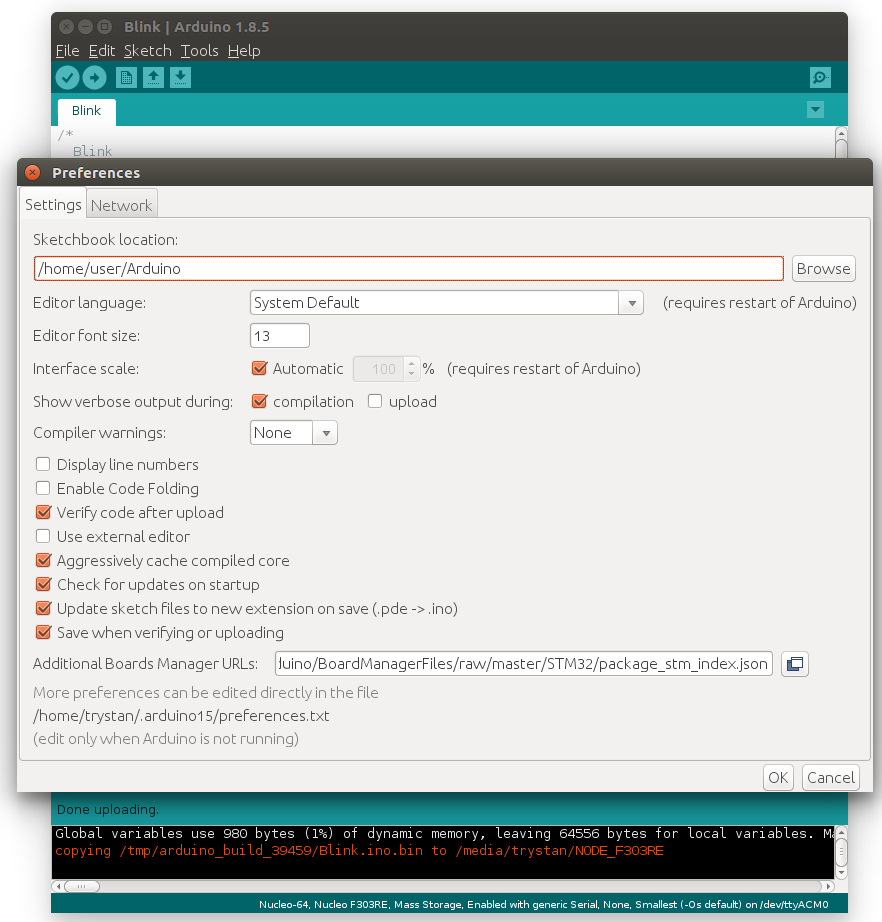
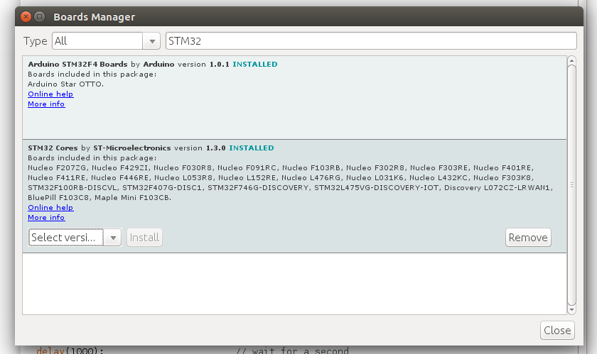
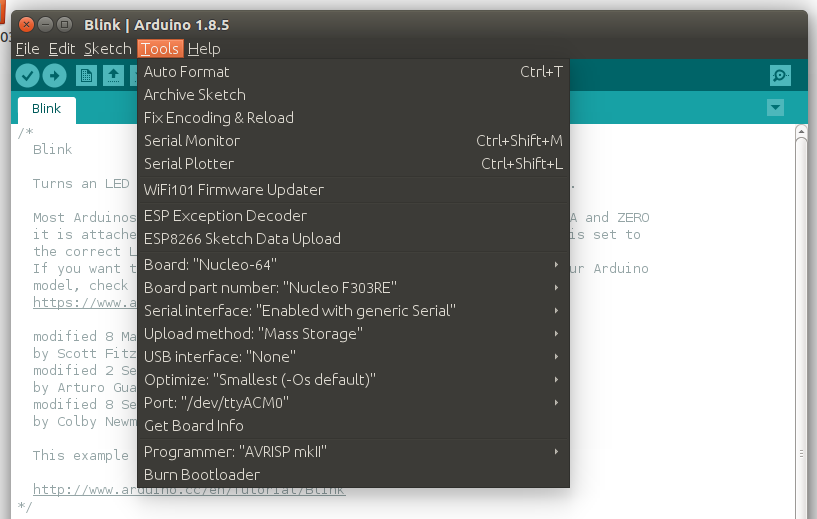

# Blinking an LED using the NUCLEO-F303RE Development board & STM32Duino

You will need:

- [Arduino IDE](https://www.arduino.cc/en/Main/Software)
- NUCLEO-F303RE Development board (e.g [From farnell £8.69](https://uk.farnell.com/stmicroelectronics/nucleo-f303re/dev-board-st-link-nucleo/dp/2467271))

1. Open Blink example: File > Examples > 01.Basics > Blink

2. Install the STM32Duino core in the Arduino IDE. Open File > Preferences. Enter the following URL in the Additional Boards Manager URLs box:

    https://github.com/stm32duino/BoardManagerFiles/raw/master/STM32/package_stm_index.json
    

Click ok to complete.
    
3. Navigate to Tools > Board > Boards Manager and search for STM32 Cores and install.

4. Under Tools select Board: Nucleo-64 & Part number: Nucleo F303RE:

5. **Compile and upload.** The on-board LED should now blink once a second. Try increasing the blink speed by reducing the delay in the example sketch.

Next: Basic NUCLEO-F303RE energy monitor using an EmonTxShield & EmonLib discreet sampling STM32Duino library.

