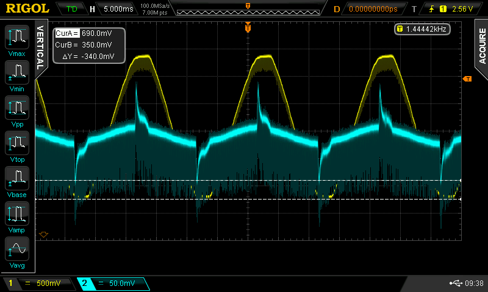

## Prototype 1: Voltage follower and anti-alias filter

[Emon3 Firmware](https://github.com/TrystanLea/STM32Dev/tree/master/Emon3):

- Voltage follower on PA6 & PA7 for bias buffer (note: HAL_OPAMP_Start(&hopamp2); required)
- Implements @Robert.Wall's offset removal technique

Anti-alias filter based on: 

Two 1k resistors + 22pF capacitors to ground, biased with output from voltage follower.

40W incandescent lightbulb:

    Vrms    Irms    RP      AP      PF      Count
    239.86  0.184   43.8    44.1    0.995   287122
    239.85  0.183   43.8    43.9    0.998   289544
    239.94  0.184   43.9    44.1    0.995   289507
    240.07  0.183   43.9    43.9    0.999   287142
    240.12  0.184   43.9    44.1    0.996   289462
    239.98  0.184   43.9    44.1    0.995   282377
    239.76  0.184   43.8    44.0    0.995   284698

Readings are printed every ~2.5 seconds (125 cycles 50Hz), ~287122 VI sample pairs every 2.5s = 115 kHz

22pF filter cap on CT input:

100pF filter cap on CT input:

No filter cap on CT input:

100pF filter cap on Voltage input (22pF on other screenshots), showing to low cut off frequency:

