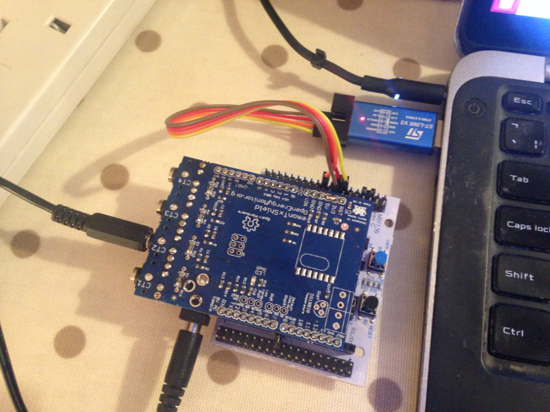

## ST Link adapters

An alternative to the integrated ST-Link-v2 programming board that comes with nucleo development boards is to use a ST-Link adapter.

Installation of st-flash

Dependencies:

    sudo apt-get install libusb-1.0-0-dev cmake

Download stlink source files:
    
    git clone https://github.com/texane/stlink stlink.git
    cd stlink.git

Make:
    
    make release
    make debug
    
    mkdir build && cd build             (is this needed?)
    cmake -DCMAKE_BUILD_TYPE=Debug ..   (is this needed?)
    
    cd build/Release; sudo make install
    sudo ldconfig
    
Upload firmware:

    st-flash write build/Blink.bin 0x8000000
     
**Troubleshooting**

    $ st-flash write build/Blink.bin 0x8000000
    st-flash 1.4.0-50-g7fafee2
    2018-10-09T20:12:38 INFO common.c: Loading device parameters....
    2018-10-09T20:12:38 INFO common.c: Device connected is: F303 high density device, id 0x10036446
    2018-10-09T20:12:38 INFO common.c: SRAM size: 0x10000 bytes (64 KiB), Flash: 0 bytes (0 KiB) in pages of 2048 bytes
    Unknown memory region

    
    

