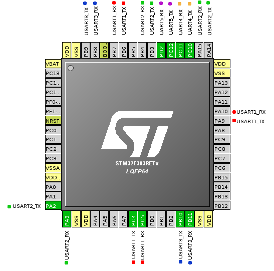
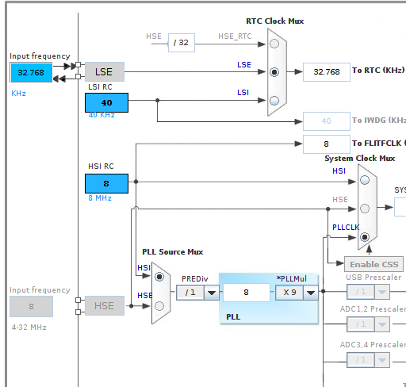
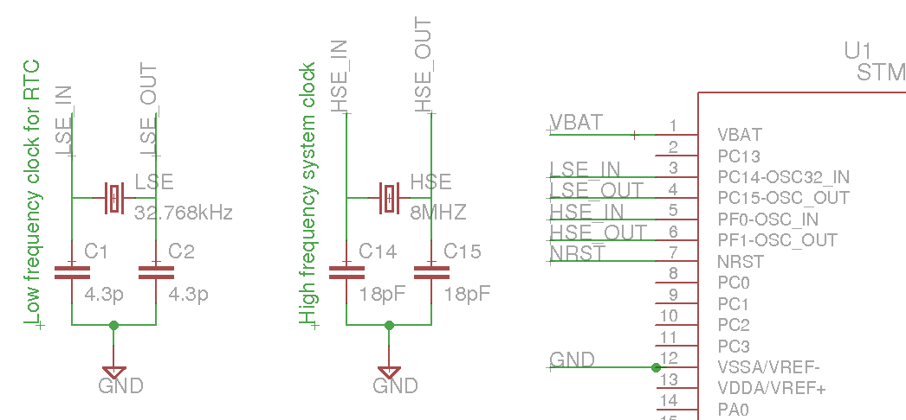

# STM32 Hardware development next steps:

The first step on my STM32 Development plan is: 

*“Work through STM32 power supply, clock, programming sub circuits, check understanding, component sourcing. Put together base board design (equivalent of a STM blue pill, or Ken’s ARMIGO) potentially with a couple of CT and ACAC sensor inputs for initial testing.”*

The concept design: A rasperrypi STM32 energy monitoring shield that fits inside the standard emon-base enclosure. The board would include: 3 CT inputs, 1 ACAC Voltage input, DS18B20 temperature sensor input, pulse counting and further spare IO possible on the limited edge space of the board.

The board would be primarily designed for use with the RaspberryPi 3B+ for full in home emoncms data logging and visualisation capability. It could however be used in conjunction with a ESP8266 Adafruit Hazzah board for a minimal ESP to remote server setup.

The idea is to then use this as the basis for expanding the design into the fully fledged expandable board with custom enclosure. A small board like this provides a managable first step in order to get the core parts right: power supply, programming, oscillators, opamp and filter design for CT & ACAC input etc.

“Like to have” extras:

- USB DFM programmer
- RFM69 radio transceiver
- ESP8266 footprint onboard
- MBUS reader

## Choosing the right core

There are a large number of STM32 core variants, all providing different feature levels, different numbers of inputs and outputs, flash, ram etc.

We have started our development so far with the STM32F303RE part of the STM32F3 range. A key benefit of this range is the availability of in-built opamps which can be used for bias buffering.

Another factor in core selection is SRAM availability. Large array’s are used to hold the ADC sample results during continuous monitoring. For example there are 2x 6000 entry long array’s of 2 byte unsigned integers in the Emon3CT example. This adds up to 23.4 kBytes of SRAM use. The STM32F303RE has 80 kBytes of SRAM while the STM32F303CBT6 has 32 kBytes. How large do the array’s need to be?

Multiple ADCs: useful for parallel sampling of Voltage and Current signals.

Number of ADC multiplexed inputs: dictates number of CT channel inputs.

For the basic RaspberryPi shield idea with 3 CT inputs, Voltage, ds18b20 temperature sensing and pulse counting the STM32F303CBT6 is probably sufficient and is almost 30% cheaper in volumes of 100x than the  STM32F303RE.

**STM32F303**

- Up to 7x fast- and ultra-fast comparators (25 ns)
- Up to 4x Op-Amp with programmable gain 
- Up to 2x 12-bit DACs 
- Up to 4x ultra-fast 12-bit ADCs with 5 MSPS 
- Up to 3x fast 144 megahertz motor control timers (resolution less than 7 ns) 
- Full-speed USB and CAN 2.0B communication interfaces 
- Core Coupled Memory SRAM (Routine Booster), a specific memory architecture boosting time-critical routines, accelerating the performance by 43% compared to Flash execution 

**STM32F303RE: Flash 512 kBytes, RAM 80 kBytes (£4.94) 100x £4.14**
[https://uk.farnell.com/stmicroelectronics/stm32f303ret6/mcu-32bit-cortex-m4-72mhz-lqfp/dp/2466939?st=stm32f303re](https://uk.farnell.com/stmicroelectronics/stm32f303ret6/mcu-32bit-cortex-m4-72mhz-lqfp/dp/2466939?st=stm32f303re)

**STM32F303CBT6: Flash 128 kBytes, RAM 32 kBytes (£4.09) 100x £2.94**
[https://uk.farnell.com/stmicroelectronics/stm32f303cbt6/mcu-32bit-cortex-m4-72mhz-lqfp/dp/2333254?st=stm32f3](https://uk.farnell.com/stmicroelectronics/stm32f303cbt6/mcu-32bit-cortex-m4-72mhz-lqfp/dp/2333254?st=stm32f3)

## STM32F303RE Peripheral pinout selection

### ADC’s

20 external ADC inputs, 18 once opamp is taken into account.
Need the voltage channel to be on a different ADC to CT channels.

CT’s could either be all on one channel for sequential reading, or distributed across multiple channels for simultaneous reading.

Opamps share same pins as ADC inputs, diagram above does not show all op-amp options.

Should we have a seperate bias for CT and Voltage channels? Start with the shared bias perhaps?

Could have:

- Voltage on ADC4_IN3 and 6 CT’s on ADC1
- Voltage on ADC4_IN3 and 9 CT’s on ADC2
- Voltage on ADC4_IN3, 6 CT’s on ADC1 and 5 CT’s on ADC2
- Voltage on ADC4_IN3, 2 CT’s on ADC1 and 9 CT’s on ADC2, further 3 on ADC3 and 1 on ADC4

route on the left ADC1 if routing is easier on the left
route on the bottom ADC2 if routing is easier on the bottom...

### UART Selection

When designing our own board we do not need to use PA2 and PA3 for Uart2 as used on the nucleo, freeing up two ADC inputs. The UARTs have all got secondary mapping on the top edge providing plenty of options:

## STM32F303CBT6 Peripheral pinout selection

ADC’s again on the bottom edge.

Shared Opamp & ADC inputs, mixed plenty of options.

UART’s on the top edge appart from UART3.

## Power Supply

**VREG Input Capacitance** 
MCP1825 Datasheet: “A typical input capacitance value of 1 μF to 10 μF should be sufficient for most applications.“ 4.7uF selected

**VREG Output Capacitance** 
The MCP1825 requires a minimum output capacitance of 1 μF for output voltage stability. Ceramic capacitors are recommended because of their size, cost and environmental robustness qualities. A maximum of 22 μF is recommended. STM32 Hardware Guide AN4206 suggests 4.7uF on VDD and 1uF on VDDA.

**Decoupling** 
Power supply and ground pins should have as low an impedance as possible (thick track widths, dedicated power supply panes). Each power supply should be decoupled with a 100nF filtering ceramic capacitor (AN4206).

**Power requirements?** 
MCP1825 is capable of providing plenty for Atmega328 and ESP8266. What are the power requirements of the STM32?

## Oscillator selection

The STM32F303 supports a number of different clock configurations. There is a high speed clock for the system clock and a low speed clock for the RTC. It can supply its own clock source using internal RC oscillators or it can be driven by external clock sources.

In order to achieve higher timing accuracy (quantification?) I have opted for including at least the 8Mhz external system clock option on the design and will likely include the LSE clock for the RTC.

Circuit diagram of clock sources:

https://uk.rsonline.com/web/p/products/1712795

## Programming

## Filter design
